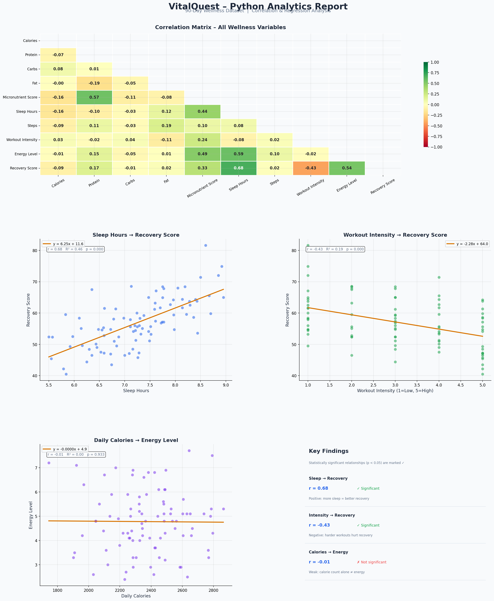

# 📊 VitalQuest Performance Analytics

## Overview
End-to-end wellness analytics project built on a 90-day 
AI-generated dataset tracking calories, sleep, workout 
intensity, recovery, and micronutrient scores.

## Tools Used
- **Tableau Public** — interactive 5-viz dashboard
- **Python** (pandas, scipy, seaborn, matplotlib) — 
  correlation matrix and linear regression analysis

## Key Findings
- Sleep is the strongest predictor of recovery 
  (r=0.68, p<0.001)
- Higher workout intensity correlates with lower 
  recovery (r=-0.43, p<0.001)
- Raw calorie count alone does not predict energy level 
  (r=-0.009, p=0.93) — food quality matters more 
  than quantity

## Dashboard
[View on Tableau Public](https://public.tableau.com/views/VitalQuestPerformanceDashboard/Dashboard1)

## Project Documentation
[View Notion Case Study](https://www.notion.so/VitalQuest-Performance-Analysis-32db2df6946880418cfcd54bd6bf823f)

## Files
| File | Description |
|---|---|
| [VitalQuest_Performance_Dataset_90_Days.csv](VitalQuest_Performance_Dataset_90_Days.csv) | 90-day synthetic wellness dataset |
| [vitalquest_analysis.py](vitalquest_analysis.py) | Python correlation & regression script |
| [VitalQuest_Python_Analysis.png](VitalQuest_Python_Analysis.png) | Output chart — correlation matrix + regressions |

## Python Analysis Output

